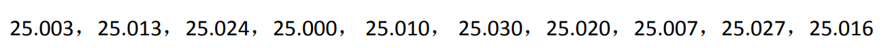
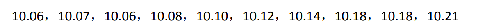
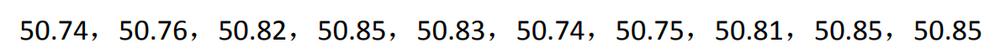

# 模式识别 Pattern Classification
## 0. 简介
* 分析数据处理的一些实例问题Python实现
* 环境: VScode + Python3.9
## 1. 实例问题
### Problem 1 (Homework II)
对一半导体材料的电阻率进行了10次的等精度测量，结果如下（单位：Ω⋅cm）：

    

计算：本次测量的算术平均值和标准偏差，并正确表示测量结果。

### Problem 2 (Homework II)
有下列一组测量数据：

    

* 采用残差观察法（作图或列表）判断是否有系统误差，若有说明系统误差类型。
* 对上题中的实验数据，试用马利科夫判据判断是否有线性系统误差的存在。

### Problem 3 (Homework III)
有如下一组电压测量数据（单位：mV）：

    

请分别采用阿贝判据和阿贝—赫梅尼判据判断是否有周期性系统误差的存在。

