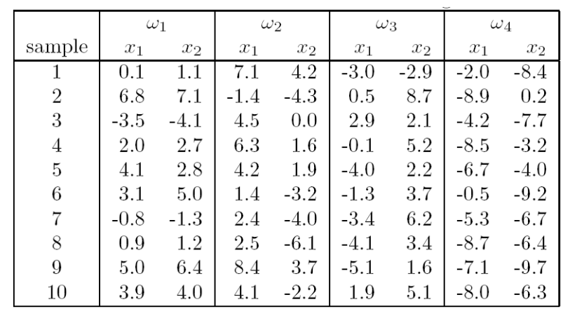

# 模式识别 Pattern Classification
## 0. 简介
* 模式识别的一些实例问题Python实现
* 环境: VScode + Python3.9
* 特别感谢\href{https://github.com/Alexiopro/AI01001H-PatternRecognition/commits?author=leofansq}{@leofansq} 同学的支持！
* [特别感谢@leofansq同学的支持！](https://github.com/Alexiopro/AI01001H-PatternRecognition/commits?author=leofansq)
## 1. 实例问题
### Problem 1 (Homework II)
现有一维空间的 50 个样本点（实际上，这些样本点是在 Matlab 中按如下语句生成的：
mu=5; std_var = 1; X=mvnrnd(mu, std_var, 50);）。现需要采用 Parzen 窗方法对概率密度函数进行估计。
* 请分别编程实现方窗和高斯窗情形下的概率密度函数估计；
* 请讨论窗宽的影响，并画出几种不同窗宽取值下所估计获得的概率密度函数曲线。
50 样本点如下:

    

### Problem 2 (Homework II)
本题关于线性分类器的构造与训练。所使用的四类二维样本（共 40 个）如下：

    

实现批量感知器算法.初始权向量$a = 0$,
* 使用程序利用$\omega_1$和$\omega_2$的数据进行训练,记录收敛步数.
* 使用程序利用$\omega_2$和$\omega_3$的数据进行训练,记录收敛步数.
请写一个程序，实现 MSE 多类扩展方法。每一类用前 8 个样本来构造分类器，用后两个样本作测试。请给出你的正确率

### Problem 3 (Homework III)

本题使用的数据如下:

第一类 10 个样本(三维空间):

[1.58, 2.32, -5.8], [0.67, 1.58, -4.78], [1.04, 1.01, -3.63], [-1.49, 2.18, -3.39], [-0.41, 1.21, -4.73],
[1.39, 3.16, 2.87], [1.20, 1.40, -1.89], [-0.92, 1.44, -3,22], [0.45, 1.33, -4.38], [-0.76, 0.84, -1.96]

第二类 10 个样本(三维空间):

[0.21, 0.03, -2.21], [0.37, 0.28, -1.8], [0.18, 1.22, 0.16], [-0.24, 0.93, -1.01], [-1.18, 0.39, -0.39],
[0.74, 0.96, -1.16], [-0.38, 1.94, -0.48], [0.02, 0.72, -0.17], [ 0.44, 1.31, -0.14], [0.46, 1.49, 0.68]

第三类 10 个样本(三维空间):

[-1.54, 1.17, 0.64], [5.41, 3.45, -1.33], [1.55, 0.99, 2.69], [1.86, 3.19, 1.51], [1.68, 1.79, -0.87],
[3.51, -0.22, -1.39], [1.40, -0.44, -0.92], [0.44, 0.83, 1.97], [ 0.25, 0.68, -0.99], [0.66, -0.45, 0.08]

* 请编写两个通用的三层前向神经网络反向传播算法程序,一个采用批量方式更新权重,另一个采用单样本方式更新权重。其中,隐含层结点的激励函数采用双曲正切函数,输出层的激励函数采用 sigmoid 函数。目标函数采用平方误差准则函数。

* 请利用上面的数据验证你写的程序,分析如下几点:
  * 隐含层不同结点数目对训练精度的影响;
  * 观察不同的梯度更新步长对训练的影响,并给出一些描述或解释;
  * 在网络结构固定的情况下,绘制出目标函数随着迭代步数增加的变化曲线。
